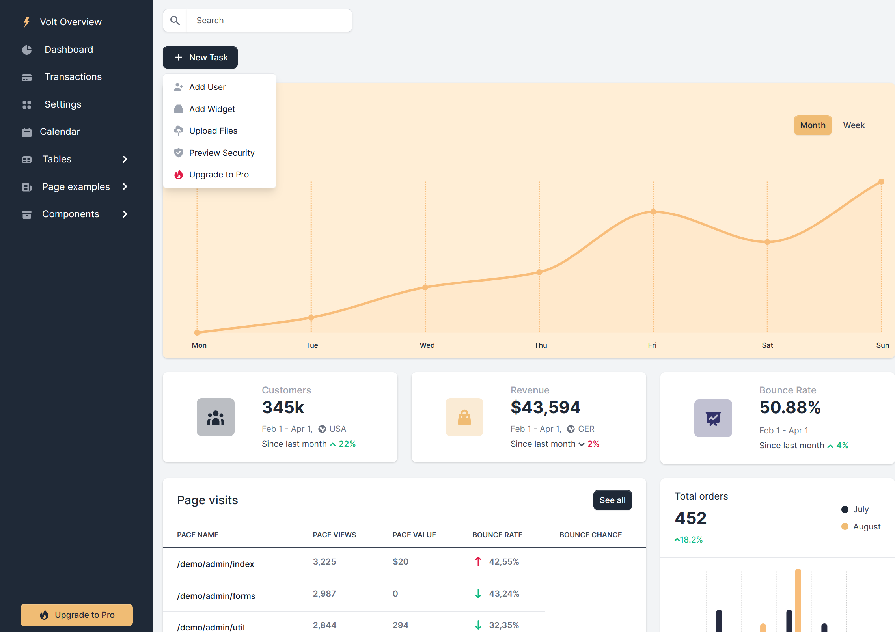

## Dash Single Page Application (SPA) Framework


**Dash/SPA** is a minimal template and component suite that allows you to build complex
**[Dash]** based multi-page applications with ease. The demo application includes
several well known Dash demos that have been pasted into the SPA framework
to show how easy it is to transition to SPA. **Dash/SPA** can be installed from [pypi]

    pip install dash-spa

### Demo

To install the demo perform the following steps:

    git clone https://github.com/stevej2608/dash-spa.git
    cd dash-spa
    pip install -r requirements.txt

Then start the demo with:

    python usage.py
or:

    python waitress_server.py

When you sign in to the demo app for the first time you will be asked to create an
admin account. Enter any email address and password you fancy. To manage users, as
admin, select **Users** from the **My Account** drop-down on the nav-bar.

#### Docker Demo Website

TODO: Check this works

Perform the following steps to build and run the demo website in an [nginx](https://www.nginx.com/) docker container.

Build demo website Docker image:

    docker build -t holoniq/dash-spa .

Run website (waitress server):

    docker run -it --rm  -p 80:5000 holoniq/dash-spa

Visit [http://localhost/](http://localhost/)

Remove image:

    docker rmi holoniq/dash-spa

### Dash/SPA Features

The following Dash/SPA features are implemented to allow [Dash] to be
more easily used at scale.

**Dash/SPA** Uses the Dash Pages [plugin]:

*/pages/example.py*
```
from dash import html
from dash_spa import register_page

register_page(path='/page1', title="Page-1")

def big_center(text, id=None):
    return html.H2(text, className='display-3 text-center')

layout = html.Div([
        big_center('Multi-page Example'),
        big_center('+'),
        big_center('Page 1'),
    ])
```

**Dash/SPA** manages component IDs using page namespaces. This greatly
reduces Dash component ID conflicts. A component ID is only defined once when the component
is created. It is then used by reference in associated Dash callbacks:

```
from dash import html
import dash_bootstrap_components as dbc
import dash_holoniq_components as dhc

page = register_page(__name__, ...')

user_name = dbc.Input(id=page.id('user'), placeholder="Enter name")
password = dhc.PasswordInput("Password", name='password', id=page.id('password'), placeholder="Enter password")

btn = html.Button('Enter', id=page.id('enter'), disabled=True)

@app.callback(btn.output.disabled, user_name.input.value, password.input.value)
def _cb_enter(user_name, password):
    return not db_validate_user(user_name, password)

```

**Dash/SPA** includes an optional NAVBAR, configured by a simple dictionary:
```
import dash_spa as spa
from pages import NAVBAR_PAGES
from dash_spa_admin import AdminNavbarComponent

NAV_BAR_ITEMS = {
    'brand' : spa.NavbarBrand(' Dash/SPA','/'),
    'left' : [spa.NavbarLink(path=path) for path in NAVBAR_PAGES],
    'right' : AdminNavbarComponent()
}

navbar = spa.NavBar(NAV_BAR_ITEMS)

layout = navbar.layout()

```
**Dash/SPA** Tables

It's easy it create great looking tables with optional search and pagination. Table cells
can contain text and active components. Table, search and pagination layout is completely flexible.


Table are defined in a few lines:

```
def create_table(id):

    state = TableContext.getState()

    df1 = filter_str(df, state.search_term)

    ordersTable = OrdersTable(
        data=df1.to_dict('records'),
        columns=[{'id': c, 'name': c} for c in df.columns],
        page = state.current_page,
        page_size = state.page_size,
        id=id
    )

    return ordersTable
```

Tables are customised by creating a custom *tableRow* method for the table:

```
def tableRow(self, index, args):
    name, views, value, rate, change = args.values()
    icon = UP if change == "Up" else DOWN
    return  html.Tr([
        html.Th(name, className='text-gray-900', scope='row'),
        html.Td(views, className='fw-bolder text-gray-500'),
        html.Td(value, className='fw-bolder text-gray-500'),
        html.Td([
            html.Div([
                icon,
                rate
            ], className='d-flex')
        ], className='fw-bolder text-gray-500')
    ])
```


**Dash/SPA** Allows easy creation of interactive forms
```
from dash_spa import SpaForm, isTriggered

frm = SpaForm('loginFrm')

email = frm.Input('Email', name='email', type='email', placeholder="Enter email")
password = frm.PasswordInput("Password", name='password', placeholder="Enter password")
button = html.Button('Sign In', type='submit')

form = frm.Form([
    email,
    password,
    button,
], title='Sign In'),


@app.callback(form.output.children, form.input.form_data)
def _form_submit(values):

    if isTriggered(form.input.form_data):
        print(values)

    return spa.NOUPDATE
```

**Dash/SPA** Support for page containers

Depending on the application you may want the markup for page(s) to be
rendered in a container. Think of a blog app as an example. The markup provided
by a Dash/Page may be one or several posts. But that page
will be rendered as content in a *posts container*. The *posts container*
renders the appropriate navbar, headers, footers, etc, together with
the content. Another page in the same application, the 404 page or admin
panel for example, may require a different container or none at
all. The idea is containers contain pages.

In Dash/SPA all pages are rendered in a *default* container but only if one
has been defined. If a default container is not defined the page is rendered as
normal.

To define a default container, in any module in the ./pages folder:

*/pages/any_module.py*
```
from dash import html
import dash_spa as spa

# Example Dash/SPA container

def my_container(layout,  **kwargs):
    try:
        # Page to be rendered

        CONTENT = layout(**kwargs) if callable(layout) else layout

        # Return the container markup with the content embedded

        return html.Div([
            MY_NAVBAR(),
            html.Br(),
            html.Div([
                html.Div([
                    html.Div([], className="col-md-1"),
                    html.Div(CONTENT, className="col-md-10"),
                    html.Div([], className="col-md-1")
                ], className='row')
            ], className="container-fluid"),
            MY_FOOTER()
        ])
    except Exception:
        page = spa.page_for('pages.not_found_404')
        return page.layout()


spa.register_container(my_container)
```

Additional containers can be defined:

*/pages/any_module.py*
```
from dash import html
import dash_spa as spa

def admin_container(layout,  **kwargs):
  ...

def products_container(layout,  **kwargs):
  ...

spa.register_container(admin_container, name='admin')
spa.register_container(products_container, name='products')

```

To use an alternative container simply register the page specifying the container to use:

    register_page(__name__,..., container='admin')

**Dash/SPA** Has protected pages

A number of layout() decorators are defined.

**@login_required**: Will test to see is a user is logged in. If not
the 404 page is displayed.

**@role_required('role')** Will test to see if the current user has
been assigned the required role. If not the 404 page is displayed.

The decorators raise exceptions that are handled by the associated
container. See [pages/containers.py](pages/containers.py)

```
from dash_spa import register_page, current_user, login_required

register_page(__name__, ...)

@login_required
def layout():
  return "Big SECRET for {current_user.name}"
```

```
from dash_spa import register_page, current_user, role_required

register_page(__name__, ...)

@role_required('admin')
def layout():
  return "Big ADMIN SECRET for {current_user.name}"
```

**Dash/SPA** Has a simple server-side session data cache based on [diskcache]. The shape of session data
is defined using [dataclasses]. An observer pattern is used to automatically update the cache
on change.

```
@session_data(id='button_state')
class ButtonState(SessionContext):
    clicks: int = 0

ctx = session_context(ButtonState)
ctx.clicks += 1
```

Any number of session data objects can be defined.


### Dash/SPA Examples

Several example are available. The most comprehensive is *Flightdeck*. Other examples are minimalistic and
focus on Dash/SPA specifics.

**1. Flightdeck** is a, 100% python, clone of the [Volt Bootstrap 5 Dashboard] from [themesberg](https://themesberg.com/). The
example demonstrates how a rich UI experience can be easily created using Dash/SPA components and patterns.

    python -m examples.flightdeck.app



The example shows how easy it is to create great looking tables with optional search and pagination. Table cells
can contain text and active components. Table, search and pagination layout is completely flexible.


**2. Minimal MultiPage** An example of a multi-page app with navbar and footer in less than sixty lines of code.

    python -m examples.multipage.app


**3. React CRA clone**

    python -m examples.cra.app

**4. Dash/SPA forms example**

    python -m examples.forms.app

### Login Manager

**Dash/SPA** Includes an optional **`LogninManager`** that supports user registration, email
authentication and login. This is provided as a demonstrator, careful consideration
to the security implications should be undertaken before using it in a public website.

Views are provided that allow:

* Register, name, email, password. Verification code send by email.
* Enter the email verification code.

* Normal user login.

* Reset forgotten password, Password reset code sent by email.
* Enter password reset code.
* Enter new password, confirm new password.
* Login using new password.

* User admin table with Add, Edit and Delete. Accessible only when signed in with *admin* rights.


#### User DB

User details are held in a local sqlite db. The SQLAlchemy model and all DB interaction is
defined in **[login_manager.py](dash_spa_admin/login_manager.py)**. It should be straight forward to
modify this for other databases.

#### Authentication mailer

The authentication mailer is configured in `spa_config.ini` this will need to be modified to include
the details for your email agent, [see below](README.md#configuration).

If you use gmail just change the user/password details in
the `[login_manager.mail]`. Emails sent by the mailer will have come
from  `[login_manager.mail].sender` edit this field as required. Gmail will flag
unknown emails as a security risk. This can be overridden in the gmail account.

### Configuration

Configuration details are in .ini files. The Dash/SPA will look for one of the
following files: 'config/spa_config.ini', 'spa_config.ini', '.env'.

An additional file, defined by the ENV var *DASH_SPA_ENV* can be defined to overwrite selected settings in the base file. If *DASH_SPA_ENV=test* then the file *spa_config.test.ini* will overwrite
entries in *spa_config.ini*

The following configuration options can be set:
```
[logging]
level=INFO

[flask]
SECRET_KEY=my secret flask password
URL_PREFIX=api

[login_manager]
; Set True to enable login manager
enabled=True
; DB holds user registration details
database_uri=sqlite:///db.sqlite
; Verify users using email verification code. If not enabled users can
; register without verification
verify_users=False

[login_manager.mail]
; User email verification agent details
sender=admin@bigjoes.com
host=smtp.gmail.com
port=465
secure=True
user=bigjoe
password=1234
```
Entries in the *.ini* files can refer to ENV variables. To keep a password
secret for example define it in the following manner:

    password=${MAIL_PASSWORD}

Dash/SPA will then read the password from the ENV variable MAIL_PASSWORD

#### Build the project

The dash-spa package is available on [pypi]. If needed, to create a local
tarball, first change the release version in *dash_spa/_version.py*, then:

    rm -rf dist dash_spa.egg-info build

    python setup.py sdist bdist_wheel

The tarball is in *dist/dash_spa-<version>.tar.gz*

To install the tarball in a dash project:

    pip install dash_spa-<version>.tar.gz

#### Testing

Pytest and [Dash Duo](https://dash.plotly.com/testing) are used for testing. To run
these tests both the Chrome browser and Chrome driver must be
installed. See [.devcontainer/Dockerfile](.devcontainer/Dockerfile) for details.

To run the tests:

    pytest

#### Publish

    twine upload dist/*

[pypi]: https://pypi.org/project/dash-spa/
[Dash]: https://dash.plot.ly/introduction
[plugin]: https://community.plotly.com/t/introducing-dash-pages-a-dash-2-x-feature-preview/57775
[Volt Bootstrap 5 Dashboard]:https://demo.themesberg.com/volt/pages/dashboard/dashboard.html
[diskcache]: https://grantjenks.com/docs/diskcache/
[dataclasses]: https://realpython.com/python-data-classes/
