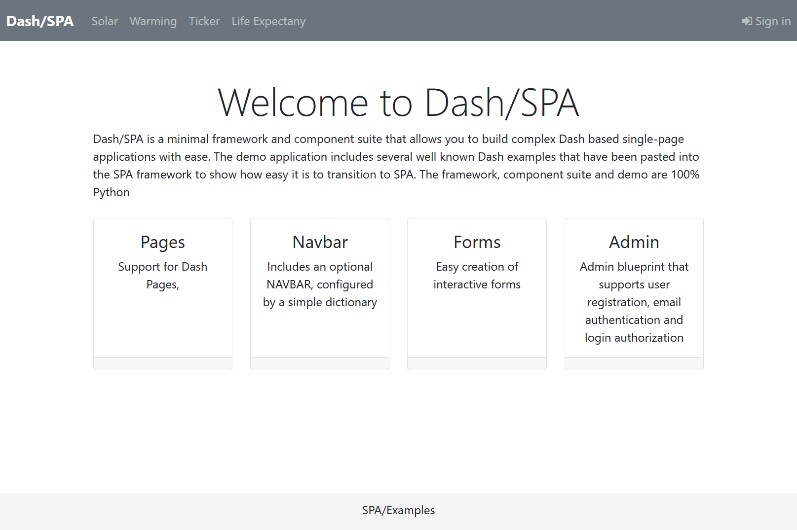

## Dash Single Page Application (SPA) Framework




    pip install -r requirements.txt
    python usage.py

When you sign in to the demo app for the first time you will be asked to create an 
admin account. Enter any email address and password you fancy. To manage users, as
admin, select **Users** from the **My Account** drop-down on the nav-bar.

**Dash/SPA** is a minimal template and component suite that allows you to build complex 
**[Dash](https://dash.plot.ly/introduction)** based multi-page applications with ease. The demo application includes
several well known Dash demos that have been pasted into the SPA framework
to show how easy it is to transition to SPA.

**Dash/SPA** supports Flask style Blueprints and route decorators:

```
import dash_html_components as html
from dash_spa import Blueprint

greetings = Blueprint('greetings')

@greetings.route('/hello')
def hello():
    return html.H2('Dash/SPA says HELLO!')

@greetings.route('/goodby')
def goodby():
    return html.H2('Dash/SPA says GOODBY!')

...

app.register_blueprint(greetings, url_prefix='/test/greetings')
```

**Dash/SPA** manages component IDs using blueprint/route based namespaces. This greatly 
reduces Dash component ID conflicts. A component ID is only defined once when the component
is created. It is then used by reference in associated Dash callbacks:

```
    user_name = spa.Input(id='user', placeholder="Enter name")
    password = spa.PasswordInput("Password", name='password', id='password', placeholder="Enter password")

    btn = spa.Button('Enter', id='enter', disabled=True)

    @app.callback(btn.output.disabled, [user_name.input.value, password.input.value])
    def _cb_enter(user_name, password):
        return not db_validate_user(user_name, password)

```

**Dash/SPA** includes an optional NAVBAR, configured by a simple dictionary:

```
NAV_BAR_ITEMS = {
    'brand' : spa.NavbarBrand('Dash/SPA','/'),
    'left' : [
        spa.NavbarLink('Global Warming','/demo/warming'),
        spa.NavbarLink('State Solar', '/demo/solar'),
        spa.NavbarLink('Ticker', '/demo/ticker?tickers=COKE'),
        spa.NavbarLink('Profile', '/user/profile'),
        spa.NavbarLink('Admin', '/admin/users'),
    ],
    'right': [
        AdminNavbarComponent()
    ],

    'footer': spa.Footer('SPA/Examples'),
}
```

**Dash/SPA** Allows easy creation of interactive forms

```
        email = spa.Input('Email', name='email', type='email', placeholder="Enter email")
        password = spa.PasswordInput("Password", name='password', placeholder="Enter password")
        button = button = spa.Button('Sign In', type='submit')

        form = spa.Form([
            email,
            password,
            button,
        ], title='Sign In'),


        @spa.callback(form.output.children, [form.input.form_data])
        def _form_submit(values):
            print(values)
            return spa.NOUPDATE
```

## Examples

**[multipage.py](examples/multipage.py)**


An example of a multi-page app with navbar and footer in less than sixty lines of code.

        python -m examples.multipage

Then visit [http://localhost:8050/demo/page1](http://localhost:8050/demo/page1)

**[checkbox table row selection](examples/table.py)**

        python -m examples.table

Then visit [http://localhost:8050/table/page1](http://localhost:8050/table/page1)

## Admin Blueprint

**Dash/SPA** Includes an optional **`admin`** blueprint that supports user registration, email 
authentication and login. This is provided as a demonstrator, careful consideration
to the security implications should be undertaken before using it in a public website.

Views are provided that allow:

* Register, name, email, password. Verification code send by email.
* Enter the email verification code.

* Normal user login.
 
* Reset forgotten password, Password reset code sent by email.
* Enter password reset code.
* Enter new password, confirm new password.
* Login using new password.

* User admin table with Add, Edit and Delete. Accessible only when signed in with *admin* rights.


### User DB

User details are held in a local sqlite db. The SQLAlchemy model and all DB interaction is 
defined in **[login_manager.py](admin/login_manager.py)**. It should be straight forward to
modify this for other databases.

### Authentication mailer

The authentication mailer is configured in `config/default.json` this will need to be modified to include
the details for your email agent, [see below](#Configuration).

If you use gmail just change the user/password details in 
the gmail options. To use a specific mailer edit the `mail_options.active` field. Emails sent by
the mailer will have come from  `mail_options.sender` edit this field 
as required. Gmail will flag unknown emails as a security risk.

## Configuration

Configuration details are held in the json file `./config/default.json`. The 
environmental variable `DASH_SPA_ENV` can be configured to instruct
Dash/SPA to use a different configuration file. 

Setting:

        DASH_SPA_ENV='production'

Will import the file `./config/production.json`. An example configuration is shown below:

```
{
  "logging": {
    "level" : "WARNING"
  },
  "flask" : {
    "secret_key" : "my secret flask password"
  },
  "user_db" : {
    "database_uri" : "sqlite:///db.sqlite"
  },
  "mail_options": {
    "sender" : "admin@joes.com",
    "active" : "gmail",
    "gmail": {
      "host": "smtp.gmail.com",
      "port": 465,
      "secure": true,
      "auth": {
        "user": "bigjoe@gmail.com",
        "password": "bigjoespassword"
      }
    },
    "plusnet": {
      "host": "relay.plus.net",
      "port": 587,
      "secure": false,
      "auth": {
        "user": "bigjoe",
        "password": "bigjoesotherpassword"
      }
    }
  }
}
```
#### Build the project

Create tarball, first change the release version in package.json, then:

    rm -rf dist dash_spa.egg-info build

    python setup.py sdist bdist_wheel

The tarball is in *dist/dash_spa-<version>.tar.gz*

To install the tarball in a dash project:

    pip install dash_spa-<version>.tar.gz

#### Testing

Pytest and [Dash Duo](https://dash.plotly.com/testing) are used for testing. To run
these tests both the Chrome browser and Chrome driver must be installed. These are
already installed in the VSCode Docker container. If you are not using remote containers
you must be install them first.

To run the tests:

    pytest

#### Publish

    twine upload dist/*

