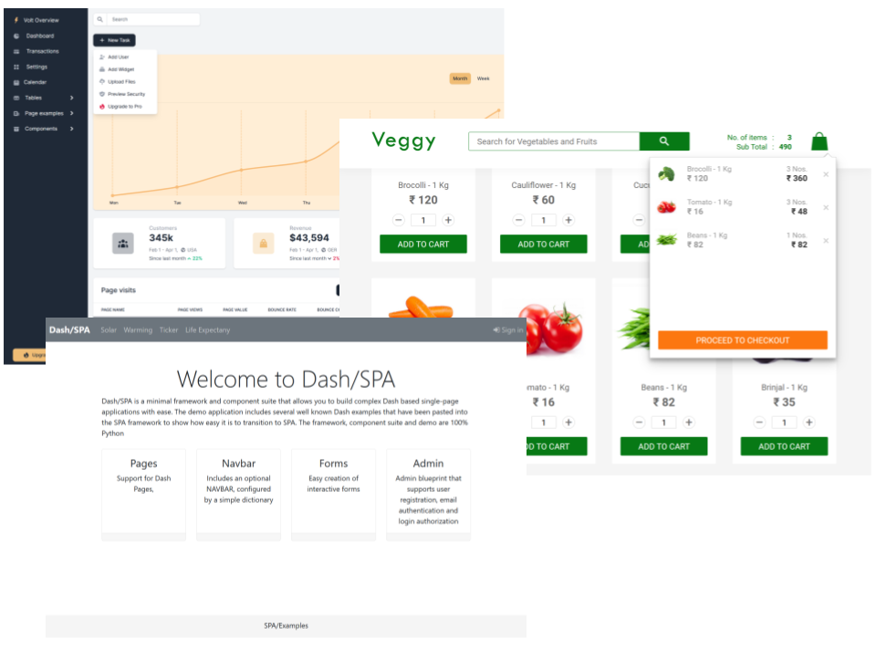

[![Build Status][build_status_badge]][build_status_link]

## Dash Single Page Application (SPA) Framework



**DashSPA** is a component suite that allows you to build complex
[Plotly/Dash] based multi-page applications with ease. The demo application includes
several well known Dash demos that have been pasted into the SPA framework
to show how easy it is to transition to SPA.

To appreciate what you can do with **DashSPA** take a look at [dash-flightdeck].

### Usage

    pip install dash-spa

or to install the optional admin support

    pip install dash-spa[admin]

### Demo and Examples

To try the demo perform the following steps:

    git clone https://github.com/stevej2608/dash-spa.git
    cd dash-spa
    pip install -r requirements.txt

Then start the demo with:

    python usage.py
or:

    python waitress_server.py

When run the demo for the first time you will be asked to create an
admin account. Enter any email address and password you fancy. To manage users, as
admin, select **Users** from the **My Account** drop-down on the nav-bar.

#### Docker Demo Website

Perform the following steps to build and run the demo website in an [nginx](https://www.nginx.com/) docker container.

Build demo website Docker image:

    docker build -t holoniq/dash-spa .

Run website (waitress server):

    docker run -it --rm  -p 80:5000 holoniq/dash-spa

Visit [http://localhost/](http://localhost/)

Remove image:

    docker rmi holoniq/dash-spa

### DashSPA Features

The following DashSPA features are implemented to allow [Plotly/Dash] to be
more easily used at scale.

**DashSPA** Uses an enhanced version of [Dash Pages](https://dash.plotly.com/urls) together
with a state context/provider pattern similar to React.js.

*simple.py*
```
from dash import html
import dash_bootstrap_components as dbc
from dash_spa import DashSPA, page_container, register_page
from server import serve_app

app = DashSPA(__name__,external_stylesheets=[dbc.themes.BOOTSTRAP])

def big_center(text):
    className='display-3 text-center'
    return html.H2(text, className=className)

def page_layout():
    return big_center('Simple Page Example')

page = register_page("test.page1", path='/page1', title='Page1', layout=page_layout)

if __name__ == "__main__":
    app.layout = page_container
    serve_app(app, debug=False, path=page.path)
```

**DashSPA** manages component IDs using page namespaces. This greatly
reduces Dash component ID conflicts. A component ID is only ever defined once when the
component is created. It is then used by reference in associated Dash callbacks:

```
from dash import html
import dash_bootstrap_components as dbc
import dash_holoniq_components as dhc

from dash_spa import register_page, callback

page = register_page(__name__, ...')

user_name = dbc.Input(id=page.id('user'), placeholder="Enter name")
password = dhc.PasswordInput("Password", name='password', id=page.id('password'), placeholder="Enter password")

btn = html.Button('Enter', id=page.id('enter'), disabled=True)

@callback(btn.output.disabled, user_name.input.value, password.input.value)
def _cb_enter(user_name, password):
    return not db_validate_user(user_name, password)

```

**DashSPA** includes an optional NAVBAR, configured by a simple dictionary:
```
import dash_spa as spa
from pages import NAVBAR_PAGES
from dash_spa_admin import AdminNavbarComponent

NAV_BAR_ITEMS = {
    'brand' : spa.NavbarBrand(' DashSPA','/'),
    'left' : [spa.NavbarLink(path=path) for path in NAVBAR_PAGES],
    'right' : AdminNavbarComponent()
}

navbar = spa.NavBar(NAV_BAR_ITEMS)

layout = navbar.layout()

```
**DashSPA** Defines a state/event pattern where a state Context is wrapped by
a @Context.Provider. Dash callback events update the contexts' state which
triggers the method decorated by the active @Context.Provider. The decorated
method then updates the UI based on the new context state.

A context can have any number of @Context.Providers. This pattern makes it
possible to create generic Dash components that communicate with host
application via ContextState.

ContextState can, if required, have session persistence.

Example usage:
```
@dataclass
class ButtonState(ContextState):
    clicks: int = 0

ButtonContext = createContext(ButtonState)

def Button(id):
    state = ButtonContext.getState()
    btn = html.Button("Button", id=id)

    @ButtonContext.On(btn.input.n_clicks)
    def btn_click(clicks):
        state.clicks += 1

@ButtonContext.Provider()
def layout():
    state = ButtonContext.getState()
    btn =  Button(id='test_btn')
    div = html.Div(f"Button pressed {state.clicks} times!")
    return html.Div([btn, div])
```

**DashSPA** Tables

It's easy it create great looking tables with optional search and pagination. Table cells
can contain text and active components. Table, search and pagination layout is completely flexible.


Tables are defined in a few lines:

```
@TableContext.Provider()
def create_table(id):

    state = TableContext.getState()

    df1 = filter_str(df, state.search_term)

    ordersTable = OrdersTable(
        data=df1.to_dict('records'),
        columns=[{'id': c, 'name': c} for c in df.columns],
        page = state.current_page,
        page_size = state.page_size,
        id=id
    )

    return ordersTable
```

Tables are customised by creating a custom *tableRow* method for the table:

```
def tableRow(self, index, args):
    name, views, value, rate, change = args.values()
    icon = UP if change == "Up" else DOWN
    return  html.Tr([
        html.Th(name, className='text-gray-900', scope='row'),
        html.Td(views, className='fw-bolder text-gray-500'),
        html.Td(value, className='fw-bolder text-gray-500'),
        html.Td([
            html.Div([
                icon,
                rate
            ], className='d-flex')
        ], className='fw-bolder text-gray-500')
    ])
```


**DashSPA** Allows easy creation of interactive forms

```
from dash_spa import SpaForm, isTriggered

frm = SpaForm('loginFrm')

email = frm.Input('Email', name='email', type='email', placeholder="Enter email")
password = frm.PasswordInput("Password", name='password', placeholder="Enter password")
button = html.Button('Sign In', type='submit')

form = frm.Form([
    email,
    password,
    button,
], title='Sign In'),


@app.callback(form.output.children, form.input.form_data)
def _form_submit(values):

    if isTriggered(form.input.form_data):
        print(values)

    return spa.NOUPDATE
```

**DashSPA** Supports page containers.

Page containers define markup wrappers for page content. This allows
layout themes to be created. In DashSPA all pages are rendered in
a *default* container but only if one has been defined. If a default
container is not defined the page is rendered raw.

To define a default container, in any module in the ./pages folder:

*/pages/<any_module>.py*
```
from dash import html
import dash_spa as spa

# Example DashSPA container

def my_container(page, layout,  **kwargs):
    try:
        # Page to be rendered

        CONTENT = layout(**kwargs) if callable(layout) else layout

        # Return the container markup with the content embedded

        return html.Div([
            MY_NAVBAR(),
            html.Br(),
            html.Div([
                html.Div([
                    html.Div([], className="col-md-1"),
                    html.Div(CONTENT, className="col-md-10"),
                    html.Div([], className="col-md-1")
                ], className='row')
            ], className="container-fluid"),
            MY_FOOTER()
        ])
    except Exception:
        page = spa.page_for('pages.not_found_404')
        return page.layout()


spa.register_container(my_container)
```

Any number of containers can be defined. To use an alternative container
simply register the page specifying the container to use:

    register_page(__name__,..., container='admin')

**DashSPA** Has protected pages

A number of layout() decorators are defined.

**@login_required**: Will test to see is a user is logged in. If not
the 404 page is displayed.

**@role_required('role')** Will test to see if the current user has
been assigned the required role. If not the 404 page is displayed.

The decorators raise exceptions that are handled by the associated
container. See [pages/containers.py](./pages/default_container.py)

```
from dash_spa import register_page, current_user, login_required

register_page(__name__, ...)

@login_required
def layout():
  return "Big SECRET for {current_user.name}"
```

```
from dash_spa import register_page, current_user, role_required

register_page(__name__, ...)

@role_required('admin')
def layout():
  return "Big ADMIN SECRET for {current_user.name}"
```

**DashSPA** Has a server-side session data cache. Back ends are available
for [diskcache] and [REDIS].

The shape of session data is defined using [dataclasses].

```
@session_data()
class ButtonState(SessionContext):
    clicks: int = 0

ctx = session_context(ButtonState)
ctx.clicks += 1
```

Any number of session data objects can be defined.

### DashSPA Examples

Several example are available. The most comprehensive is *Veggy*. Other examples are minimalistic and
focus on DashSPA specifics. See also the separate DashSPA [dash-flightdeck] dashboard project

**1. Veggy** This is a fully working clone of the React shopping cart demo, [Veggy](https://github.com/bodevone/veggy).

Written in less than 250 lines of Python, it's far smaller than the React version. Eat your (artichoke) heart out React!.


    python -m examples.veggy.app

**2. Minimal MultiPage** An example of a multi-page app with navbar and footer in less than sixty lines of code.

    python -m examples.multipage.app

**3. React CRA clone**

    python -m examples.cra.app

**4. DashSPA Forms example**

    python -m examples.forms.app

**5. DashSPA Sidebar example**

The example sidebar is less than eighty lines of code, see [sidebar.py](examples/sidebar/pages/common/sidebar.py)

    python -m examples.sidebar.app


### Login Manager

**DashSPA** Includes an optional **`LogninManager`** that supports user registration, email
authentication and login. This is provided as a demonstrator, careful consideration
to the security implications should be undertaken before using it in a public website.

Views are provided that allow:

* Register, name, email, password. Verification code send by email.
* Enter the email verification code.

* Normal user login.

* Reset forgotten password, Password reset code sent by email.
* Enter password reset code.
* Enter new password, confirm new password.
* Login using new password.

* User admin table with Add, Edit and Delete. Accessible only when signed in with *admin* rights.


#### User DB

User details are held in a local sqlite db. The SQLAlchemy model and all DB interaction is
defined in **[login_manager.py](dash_spa_admin/login_manager.py)**. It should be straight forward to
modify this for other databases.

#### Authentication mailer

The authentication mailer is configured in `spa_config.ini` this will need to be modified to include
the details for your email agent, [see below](README.md#configuration).

If you use gmail just change the user/password details in
the `[login_manager.mail]`. Emails sent by the mailer will have come
from  `[login_manager.mail].sender` edit this field as required. Gmail will flag
unknown emails as a security risk. This can be overridden in the gmail account.

### Configuration

Configuration details are in .ini files. The DashSPA will look for one of the
following files: 'config/spa_config.ini', 'spa_config.ini', '.env'.

An additional file, defined by the ENV var *DASH_SPA_ENV* can be defined to overwrite selected settings in the base file. If *DASH_SPA_ENV=test* then the file *spa_config.test.ini* will overwrite
entries in *spa_config.ini*

The following configuration options can be set:
```
[logging]
level=WARN
DASH_LOGGING=False

[flask]
SECRET_KEY=my secret flask password
URL_PREFIX=api

[session_storage]
expire_days=30
backend=diskcache
diskcache_folder=tmp/cache/spa_sessions

[session_storage.redis]
host=redis_server
;host=172.172.0.128

[login_manager]
; Set True to enable login manager
enabled=True
; DB holds user registration details
database_uri=sqlite:///db.sqlite
; Verify users using email verification code. If not enabled users can
; register without verification
verify_users=False

[login_manager.mail]
; User email verification agent details
sender=admin@bigjoes.com
host=smtp.gmail.com
port=465
secure=True
user=bigjoe
password=1234
```
Entries in the *.ini* files can refer to ENV variables. To keep a password
secret for example define it in the following manner:

    password=${MAIL_PASSWORD}

DashSPA will then read the password from the ENV variable MAIL_PASSWORD

#### Build the project

The dash-spa package is available on [pypi]. If needed, to create a local
tarball, first change the release version in *dash_spa/_version.py*, then:

    rm -rf dist dash_spa.egg-info build

    python setup.py sdist bdist_wheel

The tarball is in *dist/dash_spa-<version>.tar.gz*

To install the tarball in a dash project:

    pip install dash_spa-<version>.tar.gz

#### Testing

Pytest and [Dash Duo](https://dash.plotly.com/testing) are used for testing. To run
these tests both the Chrome browser and Chrome driver must be
installed. See [Dockerfile.dev](./Docker.dev) for details.

To run the tests:

    pytest

#### Publish

    twine upload dist/*

[pypi]: https://pypi.org/project/dash-spa/
[Plotly/Dash]: https://dash.plot.ly/introduction
[plugin]: https://community.plotly.com/t/introducing-dash-pages-a-dash-2-x-feature-preview/57775
[Volt Bootstrap 5 Dashboard]:https://demo.themesberg.com/volt/pages/dashboard/dashboard.html
[diskcache]: https://grantjenks.com/docs/diskcache/
[REDIS]: https://redis.io/
[dataclasses]: https://realpython.com/python-data-classes/
[dash-flightdeck]: https://github.com/stevej2608/dash-flightdeck

[build_status_badge]: https://github.com/stevej2608/dash-spa/actions/workflows/test.yml/badge.svg
[build_status_link]: https://github.com/stevej2608/dash-spa/actions/workflows/test.yml